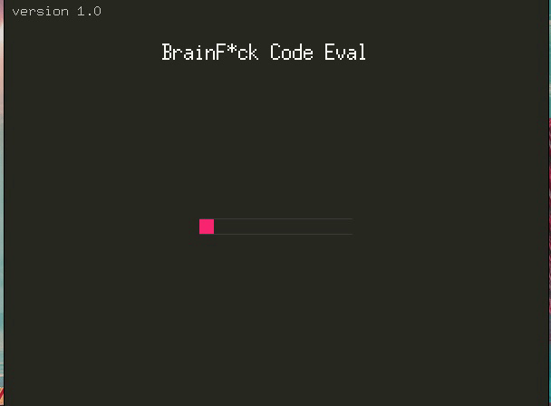

# OCaml Brainfuck GUI

A graphic implementation of brainfuck in OCaml.
The Decimal I/O mode works, the ASCII mode is not yet working.

## Usage

Load the `brainfuck.ml` and `snippet.ml` files in `utop` via:

```
utop -init utop.ml
```

You can then evaluate brainfuck strings unsing the `brainfuck` function, using the syntax `brainfuck brainfuck_string memory_size IO_mode time_between_frames`. For example:

```ocaml
# brainfuck prod 10 Decimal 0.01;;
Input a value: 6;;
Input a value: 7;;
Output : 42
- : int = 0
```



## `brainfuck.ml`

...

## `snippets.ml`

...